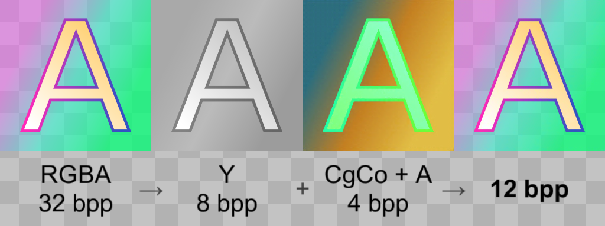
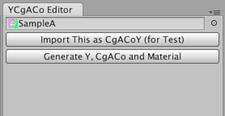
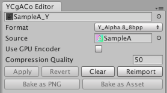
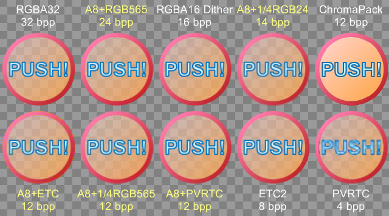

# YCCA Subsampling for Unity
YCCA subsampling is a set of lossy texture compression formats
inspired by [ChromaPack](https://github.com/keijiro/ChromaPack).
The main difference from ChromaPack is that they support **alpha**.

## Overview
* RGB is encoded into [YCgCo](https://en.wikipedia.org/wiki/YCgCo),
which can be decoded effectively.
    * Other color spaces (e.g. [YCbCr](https://en.wikipedia.org/wiki/YCbCr)
which is used in [ChromaPack](https://github.com/keijiro/ChromaPack))
can be supported by slightly modifying the encoder and decoder,
but currently they are not supported.
* Y channel is stored without compression (Alpha 8).
* Cg Co and Alpha channels are stored in compressed formats, such as:
    * 4 bpp block compression formats (ETC1, PVRTC or DXT1).
    * RGB24 and RGB565 with scaling-down.

## How to use
1. Click the menu "Window/YCgACo Editor".
2. Select source image, and then click "Generate Y, CgACo and Material".
3. Change format and quality, and click "Apply" if you need.

## Dummy PNG + AssetImporter.userData + postprocess
YCgACo Editor does not produce PNG file which contains texture data.
Instead, it produces **1 pixel dummy PNG files**, and meta files which contains the source image GUID and target compression format as **AssetImporter.userData**. The dummy PNGs are imported as actual encoded textures when they are **post-processed** by *YCgACoPostprocessor*. 

## Examples
